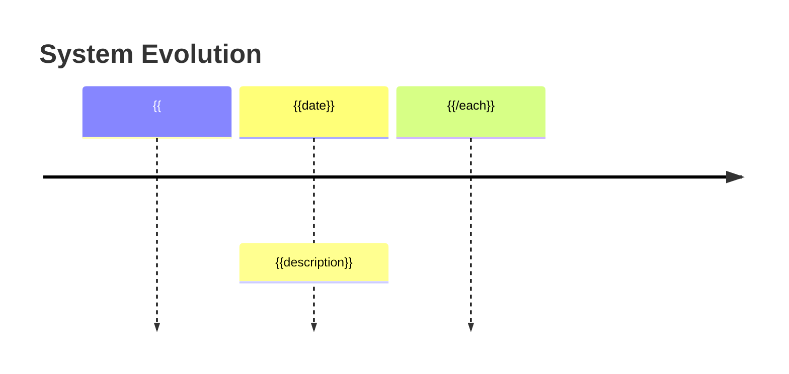
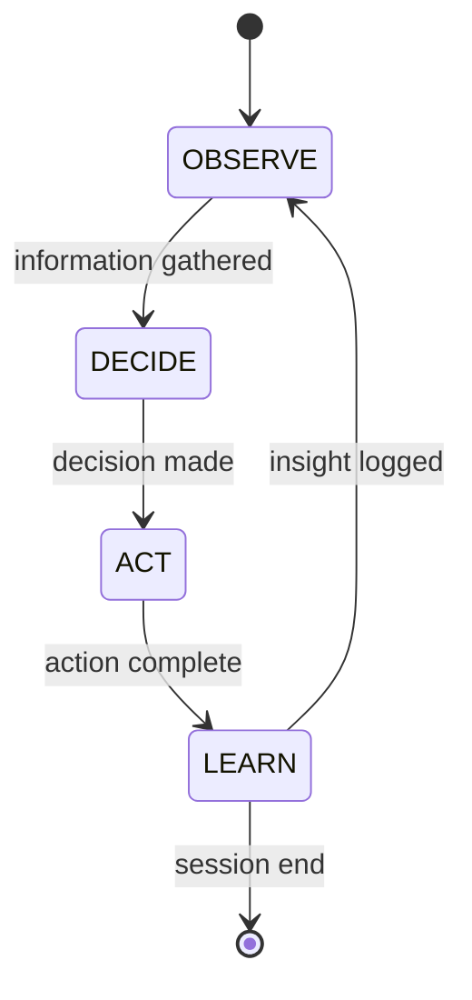

# Dashboard Patterns

> Best practices for playground dashboard components (Context7 Feb 2026)

## Pattern Categories

### 1. State Visualization

```
┌─────────────────────────────────┐
│ COMPONENT: Loop State           │
├─────────────────────────────────┤
│ Phase: [OBSERVE|DECIDE|ACT|LEARN]
│ Frame: [turkish|chinese|english|unified]
│ Last activity: {relative_time}
└─────────────────────────────────┘
```

**Implementation:**
- Read from `.loop-state.yaml`
- Update on every tool use
- Show relative time since last action

### 2. Progress Bars

```
# ASCII Progress Bar Pattern
def progress_bar(current: int, total: int, width: int = 20) -> str:
    filled = int(width * current / total)
    empty = width - filled
    return f"[{'█' * filled}{'░' * empty}] {current}/{total}"
```

**Usage:**
- Sprint progress (days elapsed / total days)
- PBI completion (done / total)
- Compliance score (percentage)

### 3. Timeline Events

```
┌─────────────────────────────────────────────────────────────┐
│ EVOLUTION TIMELINE                                           │
├─────────────────────────────────────────────────────────────┤
│ 14:00  ● code-implementer: Brand domain impl (PBI-V01)      │
│ 13:00  ● system: Integration reality check                   │
│ 12:30  ● compliance-auditor: Scripts audit (73%→95%)        │
│ 12:00  ◆ SHAPE-SHIFT: Remembrance-first enforced            │
└─────────────────────────────────────────────────────────────┘

Legend:
● = Normal event
◆ = Shape shift (major insight)
✗ = Error
⚠ = Warning
```

### 4. Agent Activity Heatmap

```
# Agent activity over time (last 24h)
#
#         00  04  08  12  16  20  24
# system  ░░  ░░  ██  ██  ░░  ░░  ░░
# orch.   ░░  ░░  ██  ░░  ░░  ░░  ░░
# cto     ░░  ██  ░░  ░░  ░░  ░░  ░░
# impl.   ░░  ░░  ░░  ██  ░░  ░░  ░░
```

### 5. Compliance Trend

```
Compliance Score Over Time
100% ┤
 90% ┤                    ████████
 80% ┤               █████
 70% ┤          █████
 60% ┤
 50% ┤     █████
 40% ┤
 30% ┤█████
 20% ┤
 10% ┤
  0% ┼────────────────────────────
     02-06  02-06  02-07  02-07
     18:00  20:00  12:00  14:00
```

## Mermaid Templates

### Gantt Chart
```mermaid
gantt
    title {{project_name}} Roadmap
    dateFormat YYYY-MM-DD
    excludes weekends

    section {{sprint_name}}
    {{#each items}}
    {{title}} :{{status}}, {{id}}, {{start}}, {{duration}}d
    {{/each}}

    section Milestones
    {{#each milestones}}
    {{name}} :milestone, {{id}}, {{date}}, 0d
    {{/each}}
```

### Timeline


### State Diagram


## Context Injection Patterns

### Minimal Context
```yaml
# For quick operations
playground:
  phase: ACT
  sprint: SPRINT-001
  blocking: []
```

### Standard Context
```yaml
# For normal operations
playground:
  phase: ACT
  sprint: SPRINT-001
  current_pbi: PBI-V01
  compliance: 95%
  truths: 16
  blocking: []
  overdue: []
```

### Full Context
```yaml
# For strategic decisions
playground:
  phase: DECIDE
  sprint: SPRINT-001
  current_pbi: PBI-V01
  compliance: 95%
  truths: 16
  shape_shifts:
    - "Remembrance-first enforced"
    - "User IS the loop"
  agent_activity:
    system: 8
    orchestrator: 3
    cto-agent: 2
  blocking:
    - "Build fails (SDK compat)"
  overdue: []
  milestones:
    - name: "Validation Gate"
      date: "2026-02-15"
      days_remaining: 8
```

## Interactive Commands

### Dashboard Refresh
```bash
/playground refresh     # Force metrics recalculation
```

### Filter Views
```bash
/playground agents      # Show only agent activity
/playground roadmap     # Show only roadmap/Gantt
/playground events      # Show only recent events
```

### Export
```bash
/playground export json  # Export metrics as JSON
/playground export md    # Export as Markdown
/playground export html  # Export as HTML dashboard
```
